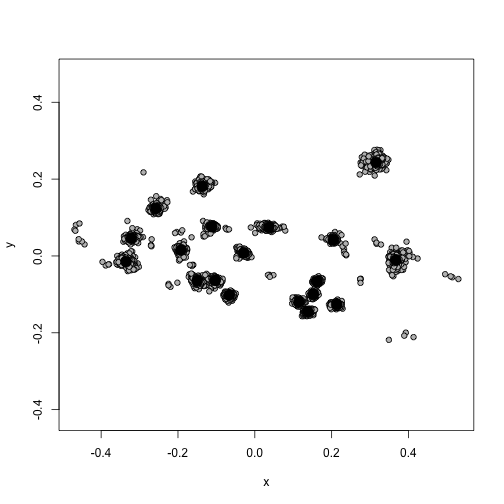
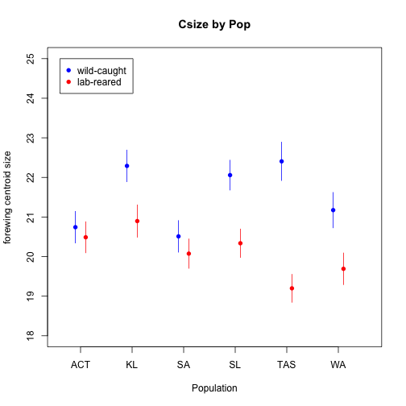
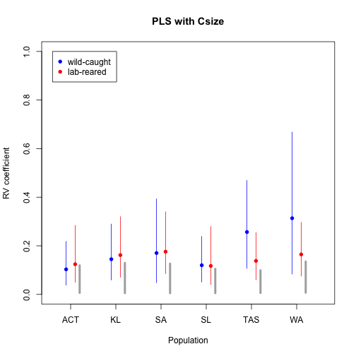
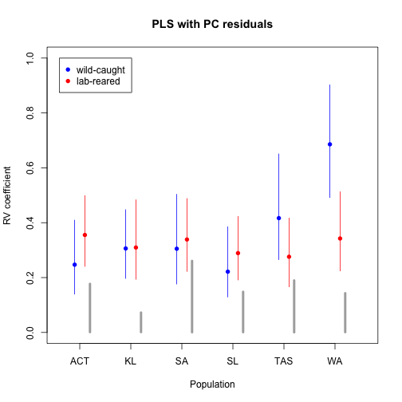
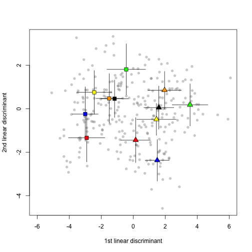
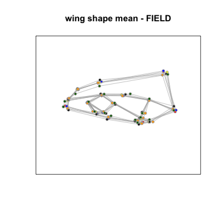
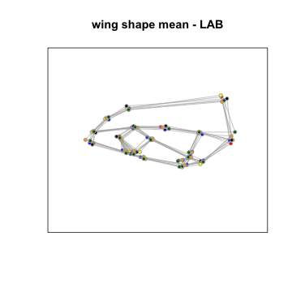

**Functions and analyses for Pitchers et al. 2014 (Accepted at Journal of Evolutionary Biology).**
***"The potential influence of morphology on the evolutionary divergence of an acoustic signal"***


If you re-run our analyses, you may find that your experience varies somehwat if you are using different versions of **R** or of the packages we use. The following details the versions we used.

R version 3.0.2 (2013-09-25)
Platform: x86_64-apple-darwin10.8.0 (64-bit)

locale:
[1] en_GB.UTF-8/en_GB.UTF-8/en_GB.UTF-8/C/en_GB.UTF-8/en_GB.UTF-8

attached base packages:
[1] grid      stats     graphics  grDevices utils     datasets  methods  
[8] base     

other attached packages:
 [1] combinat_0.0-8   effects_3.0-0    colorspace_1.2-4 plyr_1.8.1      
 [5] gdata_2.13.3     MCMCglmm_2.21    ape_3.1-2        coda_0.16-1     
 [9] lattice_0.20-29  Matrix_1.1-3     abind_1.4-0      geomorph_2.1    
[13] rgl_0.93.996     boot_1.3-11      MASS_7.3-33      car_2.0-20      
[17] knitr_1.6       

loaded via a namespace (and not attached):
 [1] corpcor_1.6.6     deSolve_1.10-8    digest_0.6.4     
 [4] evaluate_0.5.5    formatR_0.10      geiger_2.0.3     
 [7] gtools_3.4.1      jpeg_0.1-8        mvtnorm_0.9-99992
[10] nlme_3.1-117      nnet_7.3-8        permute_0.8-3    
[13] Rcpp_0.11.2       stringr_0.6.2     subplex_1.1-3    
[16] tensorA_0.36      tools_3.0.2       vegan_2.0-10     

Now we shall read in the data and perform data hygiene & sanity checks. After reading in both the calls data and the wing landmark data you ought to find that `533` crickets appear in both datasheets. The Landmark data for left wings are then reflected so that all wings appear to be right wings, and missing landmarks are replaced with values estiamted from the mean configuration. 

The landmark configurations for two individuals (LG_AC14 & LG_KL08) seem to have been misrecorded, since they do not appear to be wing-shaped, and so we excluded them from further analyses.

 

***Morphological Analyses***

Here we test for directional asymmetry. Firstly, we find that there is no evidence for asymmetry in wing size, i.e. left wings do not differ in size from right wings. In terms of shape however, we do find a significant effect of side (in a MANOVA), though the partial R^2^ of the side effect was `0.07`, i.e. only 7% of the variance in shape is explained by directional asymmetry. Since examining asymmetry was not our purpose in this study, and given the small size of this effect, we collapse the data by taking the mean shape within individuals.

 

Next, we test for differences in centroid size between generations and among populations. We found that the best model was `Csize ~ Pop + Gen + Pop_x_Gen`; including the interaction of population and generation. The ANOVA showed statistical support for the main effect of population, and for the interaction term. The plot to illustrate these differences (estimates ± SE) became Figure 5 in the MS.

 

We then tested for similar patterns of variation in wing *shape* between generations and among populations. We used a similar model, this time fitted as a MANOVA. Since we know from the previous analysis that size varies, we include size (and its interactions) in the model, giving us `SHAPE ~ Pop + Gen + Csize + Pop_x_Gen + Pop_x_Csize + Gen_x_Csize`. Since the MANOVAs can behave somewhat erratically when there is correlation among response variables, and shape data has such correlations by definition, we confirmed the results of the MANOVA using a permutation approach. We obtained the same pattern of support for the modelled effects from these two different approaches.


```
## 
## Type III MANOVA Tests: Wilks test statistic
##                   Df test stat approx F num Df den Df  Pr(>F)    
## (Intercept)        1     0.496     7.62     34    255 < 2e-16 ***
## LMs$Pop            5     0.204     2.83    170   1269 < 2e-16 ***
## LMs$Gen            1     0.604     4.91     34    255 3.7e-14 ***
## LMs$Csize          1     0.843     1.40     34    255   0.077 .  
## LMs$Pop:LMs$Gen    5     0.253     2.38    170   1269 < 2e-16 ***
## LMs$Pop:LMs$Csize  5     0.477     1.20    170   1269   0.047 *  
## LMs$Gen:LMs$Csize  1     0.834     1.49     34    255   0.046 *  
## ---
## Signif. codes:  0 '***' 0.001 '**' 0.01 '*' 0.05 '.' 0.1 ' ' 1
```

Since there is statistical support for the interactions that include wing size we used residuals from the wing-shape MANOVA to represent shape in the next set of analyses.

***Morphology & Song***

To begin with, we shall use a PLS analysis to examine covariation between call data and wing size. Given that we know (from above) that populations and generations differ in size, we will conduct this analysis *within* populations and generations. The magnitude of the covariance modelled within each analysis is expressed by the RV coefficient. We re-sampled these analyses in two different ways; firstly using a bootstrap in order to put confidence intervals on our RV coefficient estimates, and secondly using a permutation in order to estimate confidence intervals for the null hypothesis i.e. no covariance between calls and wing size.


We plotted the RV coefficients, along with their 95% confidence intervals and the 95% confidence regions on the null hypotheses in each case. This plot became Figure 6 in the MS.

 

Our approach to examining the covariance between call data and wing shape was similar; PLS analyses within populations and generations. However, since we already showed that wing size covaries with calls more stongly than would be predicted by chance, but not in all populations/both generations, we used residuals from our shape model rather than shape data itself.


Having estimated PLS axes within pop.s/gen.s we then calculated vector correlations between them as a measure of the similarity of the directions of covariation between them. We also bootstrapped this analyses to place confidence intervals on the vector correlation estimates.


As with the size-calls PLS's, we plotted the RV coefficients, along with their 95% confidence intervals and the 95% confidence regions on the null hypotheses in each case. This plot became Figure 7 in the MS.

 

The matrix of vector correlations among major axes looked like this:


```
##          AC:LAB KL:LAB SA:LAB SL:LAB TA:LAB WA:LAB
## AC:FIELD  0.713  0.635  0.613  0.811  0.827  0.545
## KL:FIELD  0.665  0.516  0.454  0.671  0.595  0.317
## SA:FIELD  0.395  0.166  0.140  0.398  0.249  0.064
## SL:FIELD  0.470  0.269  0.305  0.543  0.254  0.307
## TA:FIELD  0.436  0.314  0.352  0.241  0.240  0.225
## WA:FIELD  0.606  0.307  0.280  0.508  0.173  0.122
```


We also wanted to examine allometry within pop.s/gen.s. This next code block models `shape ~ Csize` within each pop/gen, calculates the vector correlations between the vectors of allometry coefficients and also bootstraps the same analyses to place confidence intervals on the vector correlations.


```
##          AC:LAB KL:LAB SA:LAB SL:LAB TA:LAB WA:LAB
## AC:FIELD  0.195  0.390  0.057  0.254  0.120  0.069
## KL:FIELD  0.456  0.526  0.407  0.527  0.427  0.633
## SA:FIELD  0.337  0.434  0.521  0.415  0.126  0.351
## SL:FIELD  0.582  0.599  0.573  0.558  0.042  0.570
## TA:FIELD  0.410  0.394  0.601  0.703  0.252  0.578
## WA:FIELD  0.216  0.218  0.438  0.282  0.134  0.293
```

Lastly, for Figure 6 in the MS we wanted to visualize the spread of shape variation among populations, and the interaction effect between populations and generations. This next code block calculates linear discriminant functions to best separate population/generations. It then plots the first 2 (i.e. those that account for the most variation) against each other and superimposes pop/gen means with error lines of length ±1 standard deviation.

 

---

**extra analyses after first round of reviews**

For this analysis, we use the within-population, within-generation means for both wing shape and for call data, and perform another PLS. To control for the effect of generation we ran this analysis separately in the two generations. In each case we used permutation tests to evaluate the relative magnitude of the major PLS axis.


Having calculated PLS axes (above) for the between-population shape-calls covariance, we then compared the direction of the major axis of this covariance to that of the major axis of covaraince *within* each population, using vector correlations as a measure (see function at top of this script).


Finally, this next code block plots the within-population, within-generation mean landmark coordinates for each population and connects the landmarks with lines to build up a net as a rough representation of the wing... and the variation present among them. These two plots were combined to produce Figure 4 in the MS.

  

